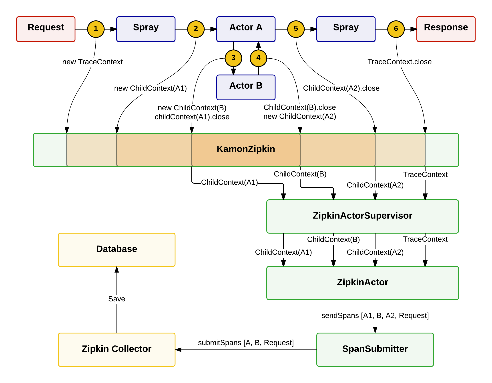

Kamon-Zipkin
============
The Kamon-Zipkin extension provide a way to get visual traces of requests.

### Add Kamon-Zipkin to a project

* Dependencies

  Add dependencies to artifacts kamon-core, kamon-akka-remote, kamon-spray et kamon-zipkin.

* AspectJ

  Add AspectJ settings to the build and add the directory META-INF with the file aop.xml

* Kamon configurations

  Add the file kamon.conf, config it as you wish, and include it into the application.conf file of your project.

* Start Kamon with the instruction Kamon.start() which must be the first instruction running in the code, before any execution of code linked to spray/akka.

  Add the annotation @EnableZipkin to the classes you want to record in details methods execution.  

### Run Zipkin

To use Zipkin, you can :
 * Clone the project at https://github.com/twitter/zipkin and run your own zipkin-collector, zipkin-query, zipkin-web and associated database.

 * Install boot2docker and docker on your computer, and run files build.sh and deploy.sh one after the other to start available docker containers which uses a redis database.

### Flow of a trace in the extension

Kamon creates for each request an unique TraceContext. This TraceContext is created when the request is processed by Spray and ends when the request has been completed.  

When an actor receives a message, an advice checks if a TraceContext exists. If it is, the execution of this actor is recorded. A ChildContext is created, with data on the current state of the request. When the actor has finished its job and has sent a message to another actor, the ChildContext is closed and sent to the ZipkinActorSupervisor. For each trace, the ZipkinActorSupervisor creates a ZipkinActor which processes ChildContexts to Spans that will be sent to Zipkin.  

When a request has been completed, created Spans are sent to the SpanSubmitter. The SpanSubmitter generates the correct hierarchy between Spans and send them to a Zipkin collector. This collector will process the Spans and save them to a  SQL/Redis/Cassandra database.

Traces can be visualized in the Zipkin web interface. A specific Zipkin query module is called to get data from the database depending of the technology used.

Two pointcuts are used to trace requests in an application :  

* The first pointcut concerns the method “receive” of the actors. The corresponding advice creates a ChildContext, subpart of the TraceContext, which will be proccessed by a ZipkinActor.

* The second pointcut checks for classes annotated with @EnableZipkin. The corresponding advice records the call of any methods/functions in these classes, that will be saved with their execution time.

### Some results

SAFE EXAMPLES

### Contributions

I used part of the nice library akka-tracing @ https://github.com/levkhomich/akka-tracing to submit Spans to Zipkin.
This work began after reading the discussion @ https://groups.google.com/forum/#!msg/kamon-user/W9ykRBmKTOo/6rTRKOOiXiEJ.